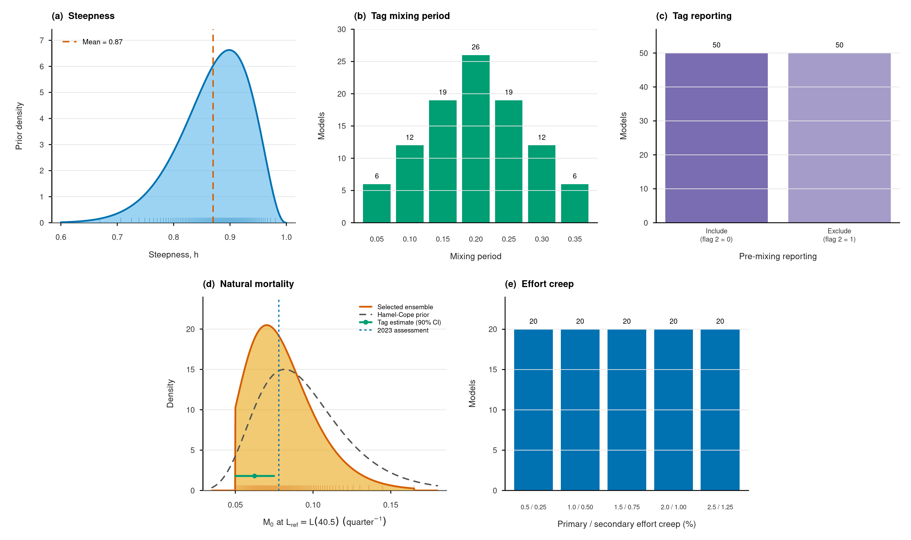

# BET 2026 Diagnostic ensemble

This repository defines a reproducible 100-model structural ensemble based on
the BET 2026 Diagnostic model. Each row of
[`design/model-draws.csv`](design/model-draws.csv) is one model configuration.
The ensemble changes only the six uncertainty axes listed below; all other
inputs, Diagnostic selectivity and the ordinary `-makepar` fitting path remain
unchanged. The preceding fixed-`tau=2` ensemble is preserved on the
[`tau=2`](https://github.com/PacificCommunity/ofp-sam-bet-2026-ensemble/tree/tau%3D2)
branch; the earlier ensemble is preserved on
[`tau=1`](https://github.com/PacificCommunity/ofp-sam-bet-2026-ensemble/tree/tau%3D1).
Relative to the `tau=2` branch, current `main` adds the three-level tau axis and
uses midpoint-stratified rather than boundary-inclusive quantiles for the same
natural-mortality distribution and replaces modular coupling with a frozen,
separately randomized pairing of all six axes. The other four axes and all
non-ensemble model settings are unchanged.

| Axis | 100-model representation |
|---|---|
| Steepness | 100 stratified quantiles from the 2024 South Pacific albacore censored beta prior: mean 0.87, SD 0.063, bounded by 0.2 and 1.0 |
| Tag overdispersion, tau | Fixed independently in each fit at `1.2`, `1.3` or `1.4`, represented by 33, 34 and 33 models |
| Tag mixing periods (`K` cutoff) | Release-group mixing periods derived at Kolmogorov dissimilarity cutoffs 0.05–0.35, with 0.20 most frequent: 6, 12, 19, 26, 19, 12 and 6 models |
| Tag reporting | MFCL tag flag column 2: 50 inclusion (`0`) and 50 exclusion (`1`) models; zero-mixing events remain excluded for current-MFCL compatibility |
| Natural mortality | 100 midpoint quantiles from a quarterly Lorenzen `M0` bounded logit-normal at `L(40.5)`: elicited controls 0.050–0.165, mode 0.0702 and median 0.078136; realised draws 0.0545–0.1328 |
| Effort creep | Five official BET/YFT scenarios with 20 models each |

The albacore steepness distribution is used as a transparent working prior
because a current BET-specific probability distribution is unavailable. It is
not presented as evidence that albacore and bigeye have identical stock–recruit
dynamics. The full rationale and sources are in
[`docs/scientific-basis.md`](docs/scientific-basis.md).

## Recreate and validate

Only base R is required.

```sh
Rscript scripts/create-ensemble-design.R
Rscript scripts/validate-ensemble-design.R
Rscript scripts/validate-all-model-inputs.R
./scripts/smoke-test-ensemble-axes
```

Continuous axes use fixed
midpoint quantiles: the distribution is divided into 100 equal 1% probability
strata and evaluated at their centres (`p = 0.005, 0.015, ..., 0.995`), not at
the finite parameter-range boundaries. These are inverse-CDF probability
midpoints, not arithmetic midpoints of the parameter range. Discrete margins
use exact counts. The six margins are paired by separate random permutations
generated once without a fixed RNG seed, then frozen in
`design/pairing-map.csv`; routine recreation and model runs never redraw them.
This avoids the lattice pattern of the preceding modular pairing while keeping
the committed 100 models exactly reproducible. The realised steepness range is
0.668843–0.980467 and the realised quarterly `M0` range is 0.054517–0.132751.
`design/model-draws.csv` is the generated source of truth for model settings.
`design/rank-correlation.csv` reports the actual pairwise rank correlations;
no composite balance score is used.

GitHub Actions recreates the deterministic design, verifies the exact prepared
inputs for all 100 models, and confirms that only the six intended axes change.
It then runs MFCL through Phase 0 for representatives spanning the minimum,
centre and maximum of steepness and natural mortality, every tau, tag-mixing,
tag-reporting and effort-creep level. The runtime audit checks the realised
steepness, natural mortality, fixed tau and unchanged DM concentration; the
static audit checks the selected effort records, tag settings and Diagnostic
F10/F33 weak non-decreasing selectivity exactly.

## Run a model

Every run starts from the frozen Diagnostic-model inputs with ordinary
`bet.ini -makepar`; no seed, jitter or fitted checkpoint is applied. The
preparation step materializes the selected steepness directly in the runnable
INI and model configuration, changes only the selected six axes, then compares
the resulting INI, Diagnostic model configuration, FRQ and `doitall.sh` against
both the design row and authoritative source files before MFCL starts. The
runner rejects any INI/config mismatch rather than rewriting steepness during
the fit. Diagnostic selectivity is likewise read from the committed 33-fishery
`model/selectivity-models/F2.csv`, applied in the phase controls and audited
after every fitted phase.

```sh
./run.sh ensemble-001
```

The output folder contains `ensemble-metadata.csv` and
`input-change-audit.csv` with full-precision values. Display labels are concise
but self-describing; for example:
`E001 | h=0.669 | tau=1.2 | K=0.20 | RR=include | M0=0.0663/qtr | creep=1.0/0.50%`.
The exact values remain in the metadata rather than the rounded label. Kflow
uses the same command with one independent Suva job per design row and a phase
10/11 convergence criterion of `1e-4`.

## Retained final PAR files

The repository directly contains the exact 80 MGC-retained native PARs under
`final-par/<source-id>/final.par`, together with the matching executable,
runnable inputs and checksum/native-load verifier. A clone is sufficient; no
Suva, Kflow or separate download is required. The bundled `mfclo64` is a
statically linked x86-64 Linux executable.

```sh
./scripts/verify-retained-final-pars final-par - 2 fast
./scripts/verify-retained-final-pars final-par - 2 native
./run.sh ensemble-001
```

The first command verifies all 80 archived identities and model controls. The
second additionally loads and evaluates every PAR with native MFCL. The third
is different: it refits one configuration from its ordinary
`bet.ini -makepar` start. Exact source IDs, exclusions and provenance are
documented in [`docs/retained-final-pars.md`](docs/retained-final-pars.md). The
existing release archive remains an optional copy of the same self-contained
material.

## Distribution figure



**Figure.** Marginal distributions of the 100-model BET 2026 structural
ensemble. Histograms and rugs show the 100 retained values; continuous curves
show the probability distributions represented by those midpoint quantiles.
Natural mortality is defined at the
reference length `L(40.5 quarters)`. The selected ensemble distribution is
shown against the Hamel (2015) longevity prior, using the updated practical
formulation of Hamel and Cope (2022), after model-specific scaling to `M0`; the
tag-based estimate and its 90% confidence interval; and the 2023
assessment value. The model reference age (10.125 years) is not an assumed
maximum age: age class 40 is a plus group, while the longevity calculation uses
`Amax = 15 years`. The selected `M0` curve approaches zero density smoothly at
both design limits; the limits are ensemble controls, not observed biological
bounds. Bar labels give the exact number of models at each discrete level. A
vector version is available as
[`design/distributions.pdf`](design/distributions.pdf).

## Outputs

- `design/model-draws.csv` — machine-readable source of truth
- `design/pairing-map.csv` — one-time unseeded random permutations coupling the six margins
- `design/distribution-parameters.csv` — exact distribution parameters
- `design/continuous-summary.csv` and `design/discrete-summary.csv` — marginal summaries
- `design/m-evidence.csv` — natural-mortality evidence and interval definitions
- `design/hamel-cope-amax-sensitivity.csv` — `Amax` 13, 15 and 16-year implications on the adult-`M` and MFCL-`M0` scales
- `design/effort-creep-sources.csv` — official source files and SHA-256 hashes
- `design/mixing-sources.csv` — official `SC22-IP10-regionMean` mixing-scenario files, source commit and SHA-256 hashes
- `design/input-validation-summary.csv` — exact preflight result for all 100 frozen inputs
- `design/rank-correlation.csv` — pairwise cross-axis association audit
- `design/distributions.png` and `design/distributions.pdf` — publication-ready figure
- `data/ensemble/retained-final-par-manifest.csv` — exact archive/PAR provenance for the 80 MGC-retained fits

These are structural ensemble draws, not optimizer jitters.

## Reusable Hessian uncertainty

The repository stores compact, checksum-locked assessment-model uncertainty
payloads under `data/estimation/`. For each of the 62 retained models with a
positive-definite Hessian, 100 correlated parameter-space draws are propagated
jointly through model dependent-variable gradients using a first-order
multivariate delta method. Recent and unfished spawning biomass retain their
joint covariance, and implicit derivatives of each model's equilibrium curves
propagate the MSY-based quantities. The 18 Near-PDH central fits remain part of
the equal-model-weight mixture, but their indefinite Hessians are not
regularized, eigenvalue-clipped or used for parameter draws. The all-model
mixture is therefore structural uncertainty augmented by available estimation
uncertainty, not complete estimation-uncertainty propagation for all 80 fits.

Both the per-model RDS files and the aggregate payload are retained with
SHA-256 manifests. Re-rendering the report therefore reuses the verified draws
and does not repeat the Hessian calculations.

## Stochastic projections and reusable caches

The projection workflow uses the fitted assessment models through the checked
model executable.
Each of the 80 models retained after applying the MGC criterion is
projected for 30 years (2025–2054) with 10 stochastic recruitment sequences.
Every fishery is catch-conditioned at its exact 2022–2024 mean annual catch;
absent fishery-quarter incidents contribute zero to that average, and future
recruitment is sampled from each model's estimated 1972–2023 recruitment
deviations; the first 20 assessment years and terminal 2024 are excluded. The
input flags retain each fishery's original catch unit: fisheries 1–11
and 29–33 are in numbers and fisheries 12–28 are in weight. Consequently the
fishery-specific conditioning values are audited individually and are never
summed as if they were a single stock-wide catch quantity.
The checksum-locked `data/projection/fishery-quarter-conditioning.csv`
reconstructs all 132 fishery-quarter means and records the exact-zero cells
used by the projection input audit.

```sh
projection/cache-native-projection MODEL_DIR ensemble-001 \
  data/projection/per-model/ensemble-001.rds
```

The command stores a compact per-model RDS containing annual stock-wide and
regional spawning biomass, no-fishing spawning biomass, depletion, terminal
MSY quantities and complete audits. Its cache key covers `final.par`, all model
inputs, `mfclo64`, the projection scripts and the locked scenario. An exact
match is reused immediately; only missing or changed models are recalculated.
Large temporary MFCL projection files are discarded after the compressed
payload and SHA-256 sidecar have passed validation. The per-model caches are
combined without rerunning MFCL using:

```sh
Rscript projection/aggregate-native-projections.R \
  data/projection/per-model data/ensemble/fit-diagnostics.csv \
  data/projection/native-projections.rds \
  data/projection/native-projection-metadata.csv
```

The checked per-model RDS files, aggregate RDS, fishery-level conditioning
table, metadata and SHA-256 manifests are committed under `data/projection/`.
A report rebuild reads those files directly; MFCL projections are
repeated only when a fitted model, executable, input, projection script or
locked scenario changes.

## Reproducible report

`./run-report` verifies all structural, Hessian and projection manifests before
applying the maximum-gradient-component criterion (MGC ≤ `1e-4`). Ten planned
configurations did not meet this criterion even after extended optimization
runs and ten had no completed result. The 80 retained models (62 PDH and 18
Near-PDH) are used for every report summary, management quantity, projection
summary and interactive-viewer entry. Historical
and current-status summaries augment equal-weight structural uncertainty with
available Hessian-based parameter uncertainty; the 2025–2054 projection
summaries combine model structure and stochastic recruitment without Hessian
draws. Rendering requires neither Kflow nor access to the original compute
nodes.

The report contrasts the 100 planned configurations with the 80 retained
models for every design axis, without publishing excluded model identifiers.
Time-dynamic Kobe and Majuro trajectories use the checksum-locked diagnostic
series under `data/diagnostic/` and the coordinate-wise annual median of the
80 retained central model series. Regional spawning potential and depletion
are reported for Regions 1–5 followed by the stock-wide `All regions` panel.
The self-contained viewer follows the sensitivity-analysis viewer layout: its
checkbox list supports simultaneous selection of any retained models, assigns
each model a fixed colour, and identifies the full configuration using
steepness, tag overdispersion, tag-mixing cutoff, pre-mixing reporting,
quarterly natural mortality and effort creep. A separate fit-summary view
lists MGC, objective function, Hessian status and the recent management
quantities for all 80 retained models. Public display labels are reassigned
sequentially as `ensemble-001` through `ensemble-080` after filtering; the
checksum-listed model map preserves the source identifiers used by the
calculation payloads.
