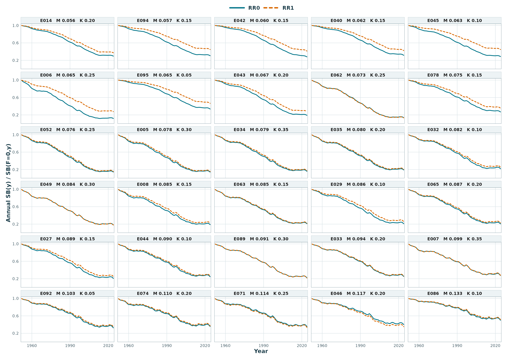
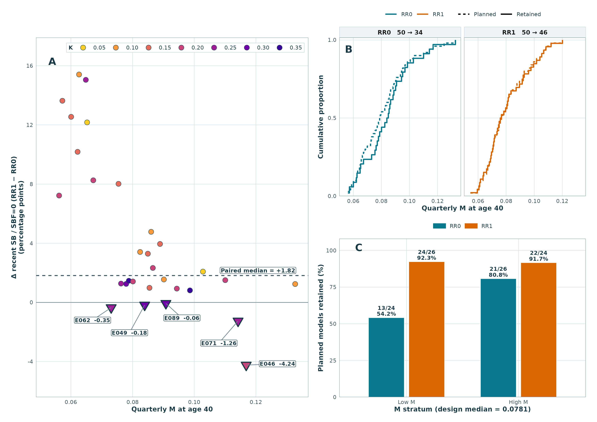

# BET 2026 exact paired RR comparison

Results and rerun instructions for the [SC22 reporting-rate follow-up](https://meetings.wcpfc.int/node/32932) (19 August 2026).

Each retained RR0 fit was refitted under RR1 with the same grid settings. Only the requested premixing tag-reporting flag changed.

| Campaign | Count |
|---|---:|
| RR0 anchors and planned RR1 counterparts | 34 |
| Completed pairs, both arms with MGC ≤ 1e-4 | 30 |
| Failed RR1 fits | 4 |

The median RR1 − RR0 change in recent SB/SB_F=0 is **+0.01816**. RR1 gives lower depletion in **5 of 30** pairs and higher F/F_MSY in **4 of 30**.

**Scope:** these are the historical TunaFlow v2.5 fits. The pre-fix MFCL implementation handled RR exclusion inconsistently; these results do not represent the corrected v2.6 sensitivity. They describe successful paired fits, with central estimates only and no Hessian uncertainty. They do not establish which setting is unbiased.

## Read the results

- [Paired quantities](rr-test/results/paired-quantities.csv) and [annual histories](rr-test/results/paired-timeseries.csv).
- [All 34 source jobs and outcomes](rr-test/results/run-manifest.csv), including the four failures.
- [Original SC22 tables and figures](rr-test/reference/), preserved with checksums.
- [RR1 PAR, REP and input files](rr-test/fits/); [RR0 anchors](final-par-rr-inclusion-flag2-0/).
- [Verification and rerun guide](rr-test/README.md).



Annual SB/SB_F=0, ordered by M. Teal: RR0; dashed orange: RR1. [PDF](rr-test/reference/rr-exact-paired-30-timeseries.pdf).



A: exact paired differences. B–C: selection in the original planned 50/50 ensemble, retained as 34 RR0 and 46 RR1 fits. [PDF](rr-test/reference/rr-exact-paired-history-selection.pdf).

## Verify or rerun

```sh
python3 rr-test/verify-results.py
Rscript rr-test/summarize.R /tmp/bet-rr-review
./rr-test/rerun rrtest-005-rr1 --dry-run
```

Reading and rebuilding the summary requires no Kflow account. Rebuilding uses base R; an actual model rerun requires Docker and the pinned Linux image. See the [guide](rr-test/README.md) for both-arm commands and output locations.

The original unpaired ensemble report remains on [RR-sens-ensemble](https://github.com/PacificCommunity/ofp-sam-bet-2026-ensemble/tree/RR-sens-ensemble).
